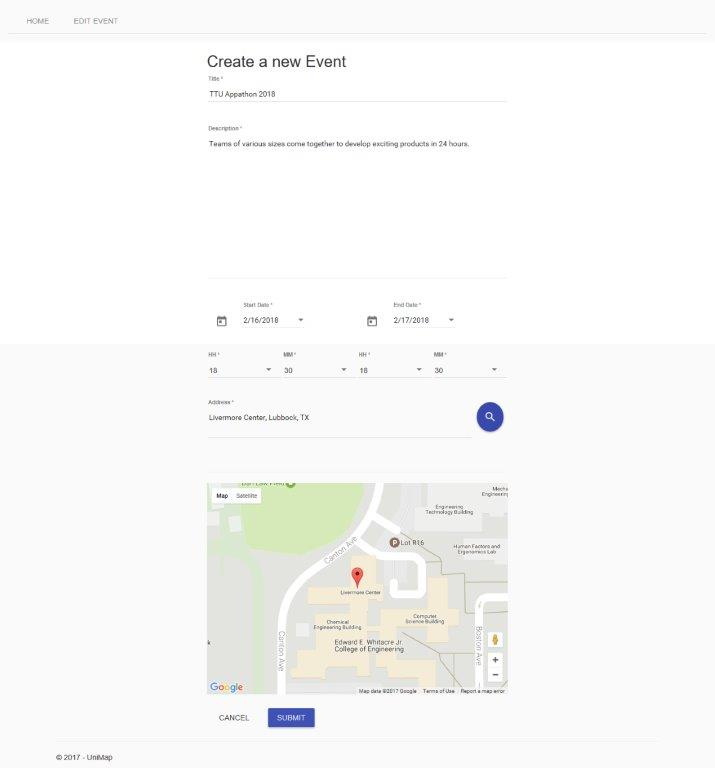

# UniMap

This project is for the [Texas Tech University Appathon](http://ttuappathon.com/). The theme for the 2017 appathon is "Map It!". This project attempted to create a web application that graphically displays events occuring on campus during a certain timeframe on a map in under 24 hours.

## After 24 Hours :coffee:

After putting 24 hours of development into this web application, the following core functionalities were demoed:

When a user first visits the site, this is their initial view. Users are able to filter events by date as well as by category. Clicking the event centers the event location, displays details, and a link to google maps.

An admin can log into the backend and create/edit events (edit still in progress).

At the end of the competition, each team demoed their work. [UniMap won 2nd place](http://ttuappathon.com/2017/02/23/winners-have-no-name/).

## Future Development

Potential ideas for future development:

- :calendar: Pull events from Google Calendar API and Office 265 API
- :point_down: Reverse geocoding
- Finish admin pages

## Built With

- ASP.Net Core
- Angular
- C#
- SQL Server

## Authors

- **Frank Ibem** - [frankibem](//github.com/frankibem)
- **Mario Jimenez** - [mariots](//github.com/mariots)
- **Patrick Tone** - [the-pat](//github.com/the-pat)
